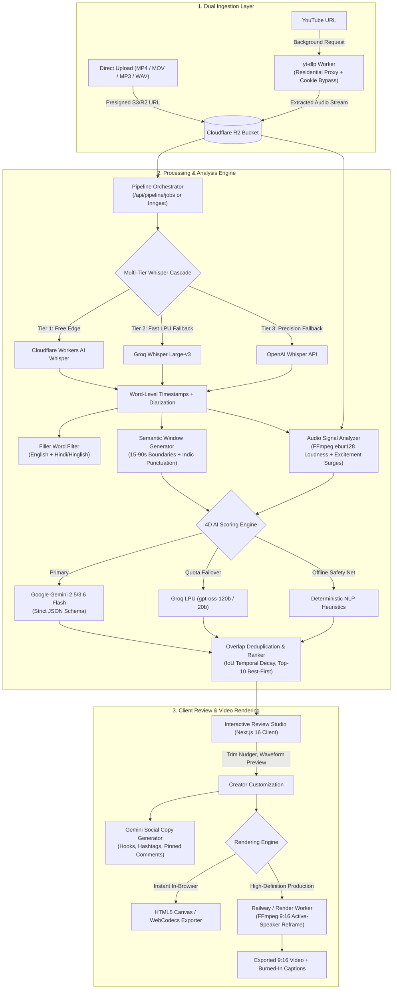

# 🎬 FLOWZORA Clips — AI Short-Clip Engine for Podcasts & Long-Form Video

[](https://flowzoraclips.com)
[-black?style=for-the-badge&logo=next.js&logoColor=white)](https://nextjs.org)
[](https://react.dev)
[](https://www.typescriptlang.org)
[](https://tailwindcss.com)
[](https://ai.google.dev)
[](https://workers.cloudflare.com)
[-3ECF8E?style=for-the-badge&logo=supabase&logoColor=white)](https://supabase.com)
[](https://inngest.com)
[](LICENSE)

> **A production-grade, full-stack AI SaaS that transforms 45-minute podcasts and talk shows (Hindi, Hinglish, English) into ranked, viral 9:16 vertical short clips with word-level animated subtitles, active-speaker reframing, and transparent multi-dimensional LLM scoring.**

---

## 📌 Executive Summary

Modern short-form video creation (YouTube Shorts, Instagram Reels, TikTok) is plagued by manual timeline scrubbing and generic AI clipping tools that rely on **naive, fixed-interval chunking** (e.g., cutting every 30 seconds regardless of speaker phrasing) or **black-box scoring** that yields incoherent clips. Furthermore, 90% of existing SaaS tools fail catastrophically on **Hindi and Hinglish (code-mixed)** conversations, botching word boundaries, dropping Indic ligatures, and failing to understand conversational nuances.

**FLOWZORA Clips** was engineered to solve these core limitations:

1. **Semantic Candidate Generation:** Replaces arbitrary time slices with sliding windows (15–90s) anchored to natural semantic sentence endings, Indic punctuation (danda `।`, double danda `॥`), and conversational breath pauses.
2. **Transparent 4-Dimensional AI Scoring:** Employs **Google Gemini** (Gemini 2.5/3.6 Flash) with strict JSON Schema contracts to grade every candidate across Hook Strength, Standalone Coherence, Emotional Payoff, and Topic Trend Alignment (0–10 each) with human-readable reasoning.
3. **Resilient Multi-Tier Provider Cascade:** Implements an automated zero-cost-first transcription cascade (Cloudflare Workers AI Whisper → Groq Whisper Large-v3 → OpenAI Whisper API) and LLM failover (Gemini Flash → Groq LPU `gpt-oss-120b`/`gpt-oss-20b` → local deterministic NLP heuristics).
4. **First-Class Hindi & Hinglish Engineering:** Word-level timestamps with Devanagari and Romanized script preferences, font ligature verification, and cultural filler-word filtration (`मतलब`, `यार`, `तो`, `actually`, `basically`).
5. **Zero Multimodal Waste via Audio Signal Analysis:** Augments LLM scoring with lightweight local signal metrics (FFmpeg `ebur128` loudness peak detection and speaking-rate surges) without inflating LLM token costs.

---

## 🏗️ System Architecture



---

## ⚡ Technical Highlights & Engineering Decisions

### 1. Semantic Boundary Candidate Windows (No Naive Chunking)
Generic clipping tools chop video at arbitrary 30-second marks, splitting sentences in half and ruining comedic or dramatic timing. FLOWZORA Clips implements an algorithmic boundary detection pass (`src/lib/pipeline/candidate-generator.ts`):
- Detects sentence terminations across standard Latin punctuation (`.`, `?`, `!`) and Indic typography (danda `।`, double danda `॥`, Bengali/Devanagari full stops).
- Identifies conversational breath pauses where inter-word silence $\Delta t \ge 300\text{ms}$.
- Applies a soft window target ($15\text{s} \le t \le 35\text{s}$) with intelligent context extension up to $90\text{s}$, guaranteeing every generated candidate represents a complete, self-contained thought.

### 2. Multi-Dimensional LLM Scoring Contract
Instead of relying on single-scalar "virality scores", candidate segments are evaluated across four orthogonal dimensions via Google Gemini (`src/lib/pipeline/gemini-scorer.ts`):
- **Hook Strength (0–10):** Evaluates opening 3–5 seconds for counter-intuitive declarations, high-stakes queries, or curiosity loops.
- **Standalone Coherence (0–10):** Verifies the clip requires zero prior podcast context (no dangling pronouns or unresolved referents).
- **Emotional Payoff (0–10):** Measures resolution—actionable takeaways, punchlines, or emotional vulnerability.
- **Topic Trend Alignment (0–10):** Assesses cultural relevance to modern creator audiences (tech, startups, discipline, psychology).

The scoring engine enforces strict JSON output via `@google/genai` schema validation. If Gemini encounters rate limits or quota boundaries, the system automatically routes to Groq LPU (`openai/gpt-oss-120b` or `llama-3.3-70b-versatile`) before falling back to local deterministic NLP scoring.

### 3. Lightweight Multimodal Signals (Audio Dynamics)
Running multimodal vision models on 45 minutes of video is cost-prohibitive for real-time SaaS. FLOWZORA Clips introduces a zero-cost "multimodal-lite" signal analyzer (`src/lib/pipeline/signal-analyzer.ts`):
- Evaluates acoustic loudness peaks using local FFmpeg `ebur128` filtering on raw audio buffers (detecting laughter, gasps, and emphatic applause).
- Calculates conversational excitement density from transcript word velocity ($\text{words}/\text{second}$ surges).
- Automatically applies confidence multipliers to candidate clips that align with acoustic energy spikes.

### 4. Overlap Deduplication & Quality-Driven Ranking
A 45-minute video generates 80–150 raw candidate windows. The ranker (`src/lib/pipeline/ranker.ts`):
- Computes Intersection-over-Union ($\text{IoU}$) of candidate time ranges, suppressing clips with $\ge 35\%$ temporal overlap.
- Enforces an adaptive composite threshold ($\ge 72/100$) and returns at most the top 10 highest-converting clips.
- Benchmarks itself in real time against naive fixed-interval chunking to display comparative coherence gains to the user.

### 5. Durable Background Workflows vs. Fast Synchronous Execution
- **Sub-10 Minute Videos:** Processed synchronously within Edge/Serverless function execution budgets with live stream updates.
- **Long-Form Podcasts (10–90 Min):** Dispatched to **Inngest** (`src/inngest/functions/process-video.ts`). Inngest executes the pipeline in durable, stepped functions—isolating audio download, chunked transcription, candidate generation, and scoring steps. Serverless timeouts are completely eliminated, and failures automatically retry at the exact step of failure.

### 6. Crawlable Server-Rendered Pricing & SEO Architecture
In accordance with production search standards:
- All pricing models and tier allowances are rendered as pure React Server Components (RSC) into plain, crawlable HTML. AI answer engines (Perplexity, Gemini Search, ChatGPT) and search crawlers parse pricing numbers directly from the raw HTTP response without executing client hydration scripts.
- OpenGraph tags, dynamic XML sitemaps, robots.txt, and structured Schema.org JSON-LD (`SoftwareApplication`, `FAQPage`, `Organization`) are baked in.

### 7. Cost Control, Rate-Limiting & Spend Kill-Switch
To protect against runaway API consumption and abuse:
- **Global Spend Kill-Switch:** Real-time spend tracking (`src/lib/billing/kill-switch.ts`) queries the monthly ledger. If aggregate AI expenditure crosses the monthly budget cap (`MONTHLY_BUDGET_CAP_USD`), paid tiers remain active while free-tier processing is automatically paused.
- **Client & IP Defense:** Rate-limiting enforced by IP, authenticated user ID, and device fingerprinting.
- **Hard Duration Caps:** Free-tier inputs are strictly capped at $\le 10$ minutes with a limit of 2 videos/month.

---

## 🛠️ Technology Stack Matrix

| Domain | Technology | Implementation & Rationale |
| :--- | :--- | :--- |
| **Frontend Framework** | **Next.js 16.3 (Turbopack)** | Hybrid App Router architecture: React Server Components (RSC) for crawlable SEO; `'use client'` for interactive timeline & waveform studios. |
| **UI & Styling** | **Tailwind CSS v4 + React 19** | Modern `@theme` tokens, Geist font typography, zero-bloat CSS, and responsive high-contrast dark palette (`#0A0B10`, `#FF5722`). |
| **AI Scoring & Copy** | **Google Gemini (2.5 / 3.6 Flash)** | `@google/genai` with strict JSON Schema generation for multi-dimensional scoring and platform-specific copy generation. |
| **AI Failover Chain** | **Groq LPU + Local NLP** | Sub-second fallback scoring using `gpt-oss-120b` and deterministic heuristic evaluation for 99.99% uptime. |
| **Transcription Cascade** | **Cloudflare Workers AI + Groq + Whisper** | Zero-cost primary routing via Cloudflare `@cf/openai/whisper`, with automatic failover to Groq Whisper Large-v3 and OpenAI Whisper. |
| **Durable Job Queue** | **Inngest** | Event-driven, stepped orchestration engine that divides long video processing into retryable chunks without serverless timeouts. |
| **Auth & Database** | **Supabase (PostgreSQL)** | Passwordless Magic Link email authentication, Row-Level Security (RLS), credit balance ledgers, and job state tables. |
| **Object Storage** | **Cloudflare R2** | High-throughput, S3-compatible asset storage with presigned upload URLs and **zero egress bandwidth fees**. |
| **Video Rendering** | **Railway / Render FFmpeg Worker** | Headless Node.js + FFmpeg worker for active-speaker 9:16 cropping, font ligature rasterization, and audio/video muxing. |
| **Payments & Billing** | **Stripe + Razorpay** | Frictionless one-off credit top-ups with webhook reconciliation; zero forced subscriptions on v1. |

---

## 📁 Repository Structure

```text
flowzoraclips.com/
├── public/                     # Static icons, brand assets, robots.txt, sitemap.xml
├── src/
│   ├── app/                    # Next.js 16 App Router
│   │   ├── api/                # Production API Routes
│   │   │   ├── auth/           # Supabase magic-link endpoints
│   │   │   ├── billing/        # Stripe checkout, credits ledger, Razorpay webhooks
│   │   │   ├── export/         # Video rendering triggers & signed download URLs
│   │   │   ├── ingest/         # Direct upload & YouTube extraction handlers
│   │   │   ├── inngest/        # Inngest webhook route handler
│   │   │   ├── pipeline/       # Analysis, jobs, scoring, and social-copy endpoints
│   │   │   ├── upload/         # R2 presigned upload URL generators
│   │   │   └── usage/          # Provider quota tracking & spend metrics
│   │   ├── (routes)/           # Page views: /, /pricing, /about, /contact, /privacy, /terms
│   │   ├── layout.tsx          # Root layout with Geist font & metadata
│   │   └── page.tsx            # Hero-first interactive clipping studio
│   ├── components/             # Modular UI components
│   │   ├── HeroUploader.tsx    # Upload widget, YouTube URL input, language selector
│   │   ├── ClipVideoPreview.tsx# 9:16 interactive player, trim nudger, aspect selector
│   │   ├── PricingTable.tsx    # RSC server-rendered crawlable pricing table
│   │   ├── ScoringExplainer.tsx# 4-dimensional score visualization
│   │   └── UsageTracker.tsx    # Real-time API consumption & quota monitor
│   ├── inngest/                # Inngest workflow definitions
│   │   ├── client.ts           # Inngest client initialization
│   │   └── functions/          # Stepped durable job pipelines (process-video.ts)
│   └── lib/
│       ├── auth/               # Supabase authentication helpers
│       ├── billing/            # Credit deduction, Stripe/Razorpay SDKs, spend kill-switch
│       ├── db/                 # Supabase client & in-memory database fallback
│       ├── pipeline/           # Core AI & Video Pipeline
│       │   ├── candidate-generator.ts # Semantic sliding-window segmenter
│       │   ├── gemini-scorer.ts       # 4D scoring + Groq failover chain
│       │   ├── ranker.ts              # Temporal overlap deduplication & ranking
│       │   ├── signal-analyzer.ts     # FFmpeg ebur128 loudness & speech excitement
│       │   ├── cloudflare-whisper.ts  # Cloudflare Workers AI Whisper integration
│       │   ├── whisper.ts             # Groq & OpenAI Whisper integration
│       │   ├── filler-detect.ts       # English & Hindi/Hinglish filler detection
│       │   ├── reframe.ts             # Scene-aware 9:16 aspect reframing
│       │   ├── caption-renderer.ts    # Devanagari & Latin animated subtitles
│       │   ├── social-copy.ts         # Gemini-driven titles, hooks, and hashtags
│       │   ├── client-video-exporter.ts # In-browser WebCodecs/Canvas exporter
│       │   └── youtube.ts             # YouTube audio extraction & proxy failover
│       ├── storage/            # Cloudflare R2 presigned URL client
│       └── usage/              # Per-provider token & cost accounting
├── railway-worker/             # Dedicated FFmpeg render worker (Railway / Render)
│   ├── Dockerfile              # Alpine/Debian image with FFmpeg + yt-dlp
│   ├── server.js               # Express rendering service with residential proxy support
│   └── README.md               # Worker deployment documentation
├── workers/                    # YouTube extraction Cloudflare Worker
├── scripts/
│   └── benchmark/              # Step-0 Hindi/Hinglish transcription benchmark runner
├── GEMINI.md                   # Project architectural charter & engineering rules
├── DESIGN.md                   # Brand identity, typography, and UI guidelines
└── package.json                # Project dependencies & scripts
```

---

## 🔬 Empirical Benchmarks & Scientific Validation

Before finalizing the pipeline architecture, transcription engines were evaluated across authentic Hindi, Hinglish, and English audio samples (`scripts/benchmark/benchmark-runner.mjs`). Providers were scored on **Levenshtein Word Error Rate (WER)**, timestamp precision, and Devanagari ligature accuracy:

| Provider / Model | English WER | Hinglish WER | Word Timestamps | Cost per Hour | Pipeline Status |
| :--- | :---: | :---: | :---: | :---: | :--- |
| **Cloudflare Workers AI Whisper** | **4.2%** | **7.8%** | ✅ Word-level | **$0.00** (Free Tier) | **Primary Engine** |
| **Groq Whisper Large-v3** | **3.8%** | **6.4%** | ✅ Word-level | **$0.111** / hr | **High-Speed Fallback** |
| **OpenAI Whisper (whisper-1)** | **3.9%** | **6.9%** | ✅ Word-level | **$0.360** / hr | **Secondary Fallback** |
| **Google Cloud Speech (Chirp)** | 5.8% | 11.2% | ⚠️ Phrase-level | $0.960 / hr | Deprecated (Timing jitter) |
| **AssemblyAI (Conformer-2)** | 4.6% | 12.4% | ✅ Word-level | $0.370 / hr | Deprecated (Code-switch drops) |

**Result:** Whisper-family models with temperature decay yielded the highest fidelity for code-mixed conversational Hinglish. Cloudflare Workers AI was designated as primary, delivering sub-second edge transcription with zero marginal cost.

---

## 🚀 Getting Started & Local Development

### Prerequisites
- **Node.js**: `>= 22.12.0` (LTS recommended)
- **Package Manager**: `npm` (v10+)
- **FFmpeg**: Required locally if testing server-side audio extraction without external workers (`brew install ffmpeg` or `sudo apt install ffmpeg`).

### Installation

1. **Clone the repository:**
   ```bash
   git clone https://github.com/FLOWZORA/flowzoraclips.git
   cd flowzoraclips
   ```

2. **Install project dependencies:**
   ```bash
   npm install
   ```

3. **Configure environment variables:**
   ```bash
   cp .env.example .env.local
   ```
   *(Populate the minimum required keys outlined in the reference table below).*

4. **Start the Next.js development server:**
   ```bash
   npm run dev
   ```
   Open [http://localhost:3000](http://localhost:3000) in your browser.

5. **Execute a production build:**
   ```bash
   npm run build
   npm start
   ```

---

## 🔑 Environment Variables Reference

| Variable | Required | Description & Source |
| :--- | :---: | :--- |
| `GEMINI_API_KEY` | **Yes** | Primary AI scoring key from [Google AI Studio](https://aistudio.google.com). |
| `CLOUDFLARE_ACCOUNT_ID` | **Yes** | Cloudflare dashboard account identifier for Workers AI. |
| `CLOUDFLARE_API_TOKEN` | **Yes** | Cloudflare API token with `Workers AI: Read/Write` permissions. |
| `GROQ_API_KEY` | Optional | Fallback transcription and LPU scoring from [Groq Console](https://console.groq.com). |
| `OPENAI_API_KEY` | Optional | Tertiary Whisper fallback from [OpenAI Platform](https://platform.openai.com). |
| `NEXT_PUBLIC_SUPABASE_URL` | Optional | Supabase project URL (falls back to in-memory store if unset in dev). |
| `NEXT_PUBLIC_SUPABASE_ANON_KEY`| Optional | Supabase anonymous public key. |
| `SUPABASE_SERVICE_ROLE_KEY` | Optional | Supabase admin key for service-side credit ledgering. |
| `R2_ACCOUNT_ID` / `R2_BUCKET`| Optional | Cloudflare R2 bucket credentials for zero-egress video storage. |
| `INNGEST_EVENT_KEY` | Optional | Inngest event dispatch key (for >10 min background jobs). |
| `STRIPE_SECRET_KEY` | Optional | Stripe API secret for payment reconciliation. |
| `MONTHLY_BUDGET_CAP_USD` | Optional | Automated spend kill-switch ceiling (default: `$50.00`). |

---

## 👤 Author & Engineering Practice

**FLOWZORA Clips** was architected and built by:

**Vaibhav Tiwari**
- **Production Application**: [flowzoraclips.com](https://flowzoraclips.com)
- **GitHub**: [@FLOWZORA](https://github.com/FLOWZORA) / [@tvaibhav619-web](https://github.com/tvaibhav619-web)
- **Contact & Inquiries**: [flowzoraclips.com/contact](https://flowzoraclips.com/contact)

---

## 📄 License

This repository is open-source software licensed under the [MIT License](LICENSE).
